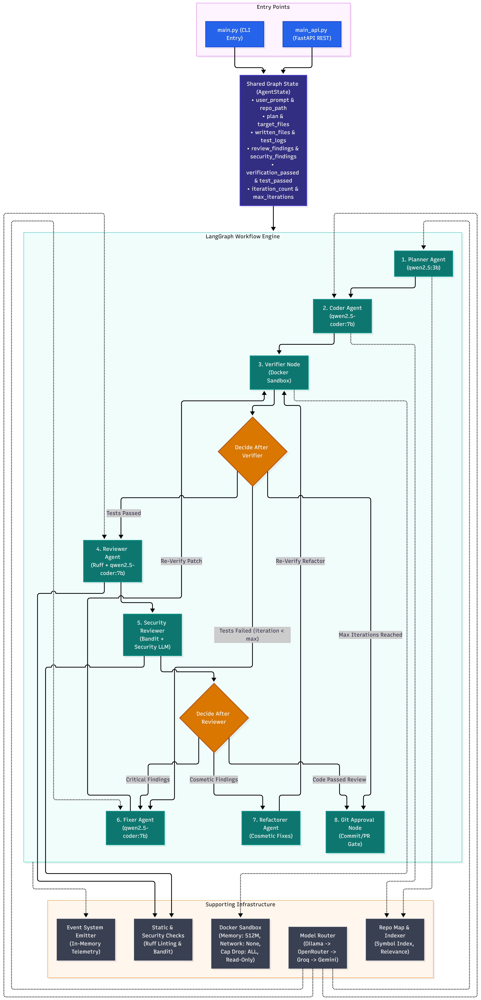

# 🤖 Autocoder

> **An Autonomous, Local-First Multi-Agent AI Coding Framework**
> *Think Claude Code + CodeRabbit — fully open, self-healing, and free to run with local models.*

Autocoder transforms plain-English software requests into **implemented, tested, reviewed, and self-healing code** using a multi-agent architecture powered by **LangGraph, Ollama, Docker, and static analysis tools**.

It follows an automated engineering loop:

**Planning → Coding → Sandboxed Testing → Code Review → Security Review → Automatic Fixing → Human Approval**

Autocoder is designed to run **locally and privately for $0**, while supporting optional cloud-model fallbacks when local models are unavailable or rate-limited.

---


# 🏗️ Architecture

<p align="center">
  
</p>

## ✨ Key Features

### 📝 Plan-First Architecture

The Planner agent analyzes the user's request before modifying the repository.

It:

* Decomposes the task into actionable steps
* Identifies relevant files
* Determines required changes
* Produces a structured implementation plan
* Passes the plan to downstream agents

---

### 💻 Autonomous Code Generation

The Coder agent converts the approved plan into working code.

It can:

* Modify existing source files
* Create new modules
* Generate unit tests
* Follow the existing project structure
* Preserve existing functionality where possible

---

### 🧪 Docker Sandboxed Verification

Generated code and tests are executed inside an isolated Docker environment.

The sandbox uses:

* `--network=none`
* `--memory=512m`
* `--cpus=1`
* `--cap-drop=ALL`
* `--read-only`
* Temporary writable `/tmp`

This prevents generated code from freely accessing the host system or external network.

---

### 🔍 Code & Security Review

Autocoder performs multiple layers of analysis.

#### Static Analysis

* **Ruff** — linting and code-quality analysis
* **Bandit** — Python security analysis

#### LLM Review

The Reviewer analyzes:

* Logic errors
* Code quality
* Maintainability
* Edge cases
* Test coverage
* Potential regressions

The Security Reviewer focuses specifically on:

* Unsafe code patterns
* Command execution
* File-system access
* Secrets
* Injection vulnerabilities
* Other security-sensitive behavior

---

### 🛠️ Autonomous Self-Healing

When verification or review discovers a problem, the Fixer agent receives the failure information and attempts a targeted patch.

The system repeats:

```text
Test
 ↓
Analyze Failure
 ↓
Generate Patch
 ↓
Apply Patch
 ↓
Run Tests Again
```

The loop is bounded by a configurable iteration limit to prevent infinite autonomous modification.

---

### 🔒 Human-in-the-Loop Approval

Autocoder does not blindly commit generated changes.

Before Git commits are created, the user receives an explicit approval checkpoint.

Security findings also require manual inspection instead of being automatically dismissed.

---

#  DataFlow Diagram

```text
                    ┌─────────────────────┐
                    │      User Prompt    │
                    └──────────┬──────────┘
                               │
                               ▼
                    ┌─────────────────────┐
                    │       Planner       │
                    │ Task + File Analysis│
                    └──────────┬──────────┘
                               │
                               ▼
                    ┌─────────────────────┐
                    │        Coder        │
                    │ Code + Test Creation│
                    └──────────┬──────────┘
                               │
                               ▼
                    ┌─────────────────────┐
                    │   Docker Sandbox    │
                    │   Test Execution    │
                    └──────────┬──────────┘
                               │
                         Tests Failed?
                         /           \
                       YES            NO
                        │              │
                        ▼              ▼
                ┌─────────────┐   ┌─────────────┐
                │    Fixer    │   │   Reviewer  │
                │ Auto Patch  │   │ Code Review │
                └──────┬──────┘   └──────┬──────┘
                       │                   │
                       └─────────┬─────────┘
                                 │
                                 ▼
                       ┌──────────────────┐
                       │ Security Review  │
                       │ Ruff + Bandit +  │
                       │      LLM         │
                       └────────┬─────────┘
                                │
                                ▼
                       ┌──────────────────┐
                       │   Refactorer     │
                       │ Optional Cleanup │
                       └────────┬─────────┘
                                │
                                ▼
                       ┌──────────────────┐
                       │  Human Approval  │
                       │  Git Checkpoint  │
                       └────────┬─────────┘
                                │
                                ▼
                       ┌──────────────────┐
                       │      Commit      │
                       └──────────────────┘
```

> The architecture diagram is available at `docs/architecture.png`.

---

# 🧩 Multi-Agent System

| Agent                    | Responsibility                               | Default Model      | Provider |
| ------------------------ | -------------------------------------------- | ------------------ | -------- |
| 🧠 **Planner**           | Task decomposition and target-file selection | `qwen2.5:3b`       | Ollama   |
| 💻 **Coder**             | Implementation and unit-test generation      | `qwen2.5-coder:7b` | Ollama   |
| 🧪 **Verifier**          | Sandboxed test execution                     | Deterministic      | Docker   |
| 🔍 **Reviewer**          | Logic, style and quality review              | `qwen2.5-coder:7b` | Ollama   |
| 🔐 **Security Reviewer** | Security analysis                            | `qwen2.5-coder:7b` | Ollama   |
| 🛠️ **Fixer**            | Surgical bug and review fixes                | `qwen2.5-coder:7b` | Ollama   |
| ♻️ **Refactorer**        | Behavior-preserving cleanup                  | `qwen2.5-coder:7b` | Ollama   |
| 👤 **Git Approval**      | Human approval before commit                 | Human              | User     |

---

# 🔀 Model Fallback Routing

Autocoder follows a local-first model routing strategy.

```text
┌──────────────────┐
│ Ollama / Local   │
│ Primary Provider │
└────────┬─────────┘
         │
         │ unavailable / limit
         ▼
┌──────────────────┐
│    OpenRouter    │
└────────┬─────────┘
         │
         │ unavailable / limit
         ▼
┌──────────────────┐
│       Groq       │
└────────┬─────────┘
         │
         │ unavailable / limit
         ▼
┌──────────────────┐
│ Google Gemini    │
└──────────────────┘
```

### Local-First Design

Local models are preferred because they provide:

* 🔒 Privacy
* 💰 Zero API cost
* ⚡ No external dependency
* 📴 Offline development
* 🎛️ Full control over models

Cloud providers act as optional fallback routes.

---

# 🔒 Security Architecture

Security is treated as a first-class component of Autocoder.

## 🐳 Isolated Execution

Generated code is executed inside Docker rather than directly on the host.

Default restrictions include:

```text
Network        → Disabled
Memory         → 512 MB
CPU            → 1 Core
Capabilities   → Dropped
Root FS        → Read-only
/tmp           → Temporary writable filesystem
```

---

## 🌐 Network Isolation

Sandboxed execution defaults to:

```bash
--network=none
```

This prevents generated test code from making arbitrary network connections.

---

## 🚫 Command Filtering

Shell operations are validated against configured allowlists before execution.

This reduces the risk of agents executing unintended commands.

---

## 🔐 Security Review

Security findings are processed separately from normal code-quality issues.

The pipeline combines:

```text
Bandit
   +
LLM Security Review
   +
Command Restrictions
   +
Docker Isolation
```

Security-related findings require manual inspection before they can be considered resolved.

---

# 🔄 Autonomous Feedback Loop

Autocoder is designed around an iterative software-engineering loop.

```text
User Request
     │
     ▼
   Plan
     │
     ▼
   Code
     │
     ▼
Generate Tests
     │
     ▼
Sandbox Execution
     │
     ├─────────────── Tests Pass ───────────────┐
     │                                          │
     ▼                                          ▼
Tests Fail                                  Code Review
     │                                          │
     ▼                                          ▼
   Fixer                                  Security Review
     │                                          │
     └────────────── Run Again ◄────────────────┘
                        │
                        ▼
                 Human Approval
                        │
                        ▼
                     Commit
```

The loop is bounded to avoid uncontrolled autonomous changes.

---

# 📊 Example Execution Report

After completing a task, Autocoder produces a structured report:

```text
╔════════════════════════════════════════════╗
║        AUTONOMOUS CODING REPORT            ║
╠════════════════════════════════════════════╣
║ Status          SUCCESS                    ║
║ Tasks           1                           ║
║ Files modified  3                           ║
║ Tests           14 passed                   ║
║ Tests failed    0                           ║
║ Fix iterations  2                           ║
║ Review issues   1 resolved                  ║
║ Sandbox         Docker                      ║
║ Git status      Awaiting approval           ║
╚════════════════════════════════════════════╝
```

This provides visibility into what the autonomous system actually did.

---

# 🛠️ Tech Stack

| Layer               | Technology                 |
| ------------------- | -------------------------- |
| Agent Framework     | LangGraph                  |
| LLM Runtime         | Ollama                     |
| Local Coding Model  | Qwen2.5-Coder              |
| Planning Model      | Qwen2.5                    |
| Sandbox             | Docker                     |
| Static Analysis     | Ruff                       |
| Security Analysis   | Bandit                     |
| Language            | Python                     |
| API                 | FastAPI                    |
| Configuration       | YAML                       |
| Version Control     | Git                        |
| Repository Analysis | AST / Indexing             |
| Cloud Fallback      | OpenRouter / Groq / Gemini |

---

# 📁 Project Structure

```text
autocoder/
│
├── agents/
│   ├── planner.py
│   ├── coder.py
│   ├── verifier.py
│   ├── reviewer.py
│   ├── security_reviewer.py
│   ├── fixer.py
│   └── refactorer.py
│
├── analysis/
│   ├── ruff.py
│   └── bandit.py
│
├── config/
│   ├── agents.yaml
│   ├── models.yaml
│   │
│   └── workflows/
│       ├── default.yaml
│       ├── fast.yaml
│       ├── review.yaml
│       └── security.yaml
│
├── events/
│   └── event_logger.py
│
├── index/
│   └── repository_indexer.py
│
├── languages/
│   └── adapters/
│
├── models/
│   ├── ollama.py
│   ├── openrouter.py
│   ├── groq.py
│   └── gemini.py
│
├── reporting/
│   ├── terminal.py
│   └── json_report.py
│
├── tools/
│   ├── docker_sandbox.py
│   ├── file_tools.py
│   └── git_tools.py
│
├── graph_builder.py
├── main.py
├── main_api.py
├── requirements.txt
└── README.md
```

---

# ⚙️ Workflow Configurations

Autocoder supports multiple workflows depending on the task.

### Default Workflow

Full autonomous engineering loop:

```text
Plan
 → Code
 → Test
 → Review
 → Security Review
 → Fix
 → Refactor
 → Human Gate
```

Run:

```bash
python main.py \
  --workflow default \
  --repo-path ./workspace \
  --prompt "Add input validation to the login endpoint"
```

---

### Fast Workflow

Designed for smaller changes:

```text
Plan
 → Code
 → Test
 → Human Gate
```

Run:

```bash
python main.py \
  --workflow fast \
  --repo-path ./workspace \
  --prompt "Add a function to validate email addresses"
```

---

### Review Workflow

Read-only repository analysis:

```text
Repository
    │
    ▼
Static Analysis
    │
    ▼
LLM Review
    │
    ▼
Report
```

No source modifications are required.

---

### Security Workflow

Dedicated security analysis:

```text
Repository
    │
    ▼
Bandit
    │
    ▼
Security LLM Review
    │
    ▼
Security Report
```

---

# 🚀 Getting Started

## Prerequisites

Install:

* Python 3.11+
* Ollama
* Docker
* Git

Docker is recommended because the verifier uses containerized execution.

---

## 1. Clone the Repository

```bash
git clone <your-repo-url>

cd autocoder
```

---

## 2. Create a Virtual Environment

### Windows

```powershell
python -m venv .venv

.venv\Scripts\activate
```

### Linux / macOS

```bash
python -m venv .venv

source .venv/bin/activate
```

---

## 3. Install Dependencies

```bash
pip install -r requirements.txt
```

---

## 4. Start Ollama

Install and start Ollama, then pull the required models:

```bash
ollama pull qwen2.5:3b
ollama pull qwen2.5-coder:7b
```

Verify:

```bash
ollama list
```

---

## 5. Start Docker

Make sure Docker Desktop or the Docker daemon is running.

Verify:

```bash
docker version
```

---

# ▶️ Run Autocoder

Run a simple coding task:

```bash
python main.py \
```
